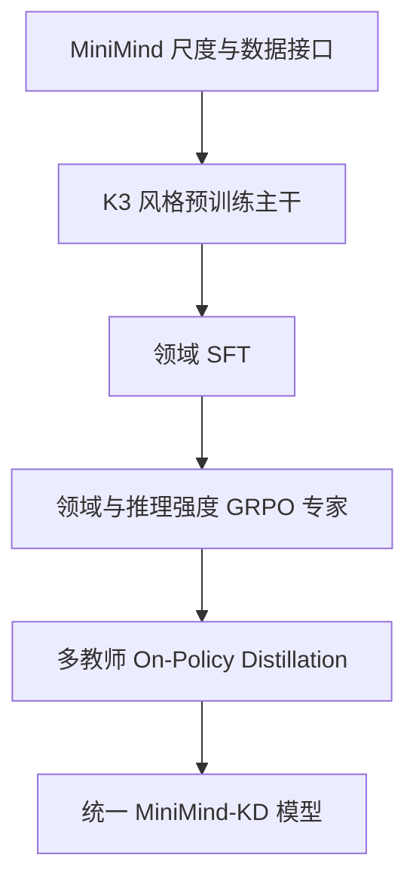

# MiniMind-KD

一个面向学习与小规模实验的独立研究项目：在 MiniMind 易读、可从零训练的工程尺度上，实现 Kimi K3 文本主干的关键预训练结构，并实现 DeepSeek V4 技术报告公开的后训练主线。仓库同时提供可复现的 KD CPU 工程跑分，并固定引用原版 MiniMind 的公开能力成绩作为对照。

> [!IMPORTANT]
> 本项目不是 MiniMind、Moonshot AI 或 DeepSeek-AI 的官方项目，也不声称复现 Kimi K3 或 DeepSeek V4-Flash-0731 的能力。它不包含任何官方权重、私有数据、训练配方或未公开实现。项目名中的 `KD` 表示 **Kimi × DeepSeek**，同时也呼应最终的 on-policy distillation 阶段。

## 技术组合



预训练主干包含：

- 3:1 的 `Kimi Delta Attention → Gated MLA` 混合注意力，最后一层固定为全局 MLA；
- 无 RoPE 的 Gated MLA（独立 Q/K、直接 K、V 头维）、KDA 下界衰减门、ShortConv、全秩输出门；
- 在 Attention 与 MoE 两个子层前分别执行的 Block Attention Residuals；
- latent 降维路由、共享专家、SiTU-GLU、聚合后 RMSNorm 和 Quantile Balancing；
- 矩阵参数 Muon、Q/K/V 的 per-head 正交化、其他参数 AdamW；
- next-token loss 与一个轻量 t+2 MTP 辅助目标；
- 可选的 routed-expert MXFP4/E2M1 fake-QAT。

后训练包含：

- 分领域 SFT；
- 可验证奖励或本地 generative reward 的 GRPO 专家训练；
- `none / high / max` 三种推理强度及不同长度惩罚；
- `<think>` 格式、`<|DSML|tool_calls>` XML 风格工具调用与交错思考上下文管理；
- 学生自己生成轨迹、按领域选择教师、计算全词表 `KL(student || teacher)` 的多教师 OPD。

完整的忠实度边界见 [docs/reproduction_boundaries.md](docs/reproduction_boundaries.md)。

## 安装

需要 Python 3.10+。训练建议使用支持 BF16 的 CUDA GPU；单元测试可在 CPU 上运行。

```bash
git clone https://github.com/cblog666/minimind-kd.git
cd minimind-kd
python -m venv .venv
source .venv/bin/activate
pip install -e ".[train]"
```

项目没有任何托管模型 API 客户端，也不需要 API Key。

## 1. Tokenizer

可以直接指向本地 MiniMind tokenizer 目录；此时协议标记可能被拆成多个 token，但预训练兼容：

```bash
git clone https://github.com/jingyaogong/minimind.git ../minimind
# 后续命令使用：--tokenizer ../minimind/model
```

若要训练推理/工具调用模型，建议重新训练 tokenizer，使专用标记成为原子 token：

```bash
minimind-kd-tokenizer \
  --data /path/to/pretrain.jsonl \
  --output out/tokenizer \
  --vocab-size 6400
```

训练前必须让 YAML 中的 `model.vocab_size` 与 `len(tokenizer)` 完全一致，并使用不同的 PAD 与 EOS token。程序会主动检查，避免 embedding 越界、EOS 被当作 padding 或静默错位。

## 2. 预训练

数据为 UTF-8 JSONL，每行至少包含 `text`：

```json
{"text": "语言模型通过预测下一个 token 学习文本分布。"}
```

```bash
minimind-kd-pretrain \
  --config configs/tiny.yaml \
  --data /path/to/pretrain.jsonl \
  --tokenizer out/tokenizer \
  --output out/pretrain
```

`tiny.yaml` 用于打通流程；`small.yaml` 用于实际小模型实验。`k3_shape_reference.yaml` 只记录官方报告中的结构尺寸，不能用本仓库的教学版 KDA 直接训练 2.8T 模型。

## 3. 领域 SFT

支持 MiniMind 风格的 `prompt/response`，也支持以 assistant 结尾的 messages：

```json
{"messages":[{"role":"user","content":"计算 9×7"},{"role":"assistant","content":"<think>...</think>答案是 63。"}]}
```

```bash
minimind-kd-sft \
  --config configs/tiny_posttrain.yaml \
  --data examples/data/sft_math.jsonl \
  --tokenizer out/tokenizer \
  --checkpoint out/pretrain/final \
  --output out/experts/math-sft
```

## 4. GRPO 专家

默认奖励全在本地计算。示例使用数值答案验证和格式奖励，不执行模型生成的代码，也不会把数据发送到外部服务。

```bash
minimind-kd-grpo \
  --config configs/tiny_posttrain.yaml \
  --data examples/data/grpo_math.jsonl \
  --tokenizer out/tokenizer \
  --checkpoint out/experts/math-sft/final \
  --output out/experts/math-high \
  --steps 100
```

为 math、code、agent、instruction 以及不同 reasoning effort 分别训练专家。难以规则验证的任务可接入 `LocalGenerativeReward`，但它只接受调用方提供的本地生成函数。

## 5. 多教师 OPD 合并

先复制并修改 `configs/teachers.example.yaml`，全部 checkpoint 都是本地路径：

```bash
minimind-kd-opd \
  --config configs/tiny_posttrain.yaml \
  --data examples/data/opd_prompts.jsonl \
  --tokenizer out/tokenizer \
  --student out/pretrain/final \
  --teachers configs/teachers.example.yaml \
  --output out/unified-opd \
  --steps 100
```

OPD 对学生生成的 completion 做 teacher-forcing，并在每个 completion token 上保留完整 vocabulary 分布计算 reverse KL；它不是离线蒸馏，也不是直接做权重平均。

## 6. 本地推理

```bash
minimind-kd-chat \
  --checkpoint out/unified-opd/final \
  --tokenizer out/tokenizer \
  --effort high \
  --prompt "Explain why the sky is blue."
```

当前 `generate` 为便于理解的全前缀重算版本。生产推理需要把 KDA recurrent state、ShortConv state 和 MLA KV cache 接入 fused kernel；本项目不会把教学实现宣传成百万上下文高性能推理。

## 性能与原版 MiniMind 对照

原版 MiniMind 不在这里重复运行。下表直接引用其仓库在提交 [`393e387`](https://github.com/jingyaogong/minimind/blob/393e387e9ad99f0f04c296e4c5e7353f4444629f/README.md#-客观评测) 公布的 `lm-evaluation-harness` 成绩：

| 模型 | 参数量 | C-Eval / CMMLU | ARC-Easy / PIQA / OpenBookQA / HellaSwag / Social-IQA |
|---|---:|---:|---:|
| MiniMind-3（原项目公布） | 64M | 24.89 / 25.38 | 28.49 / 50.65 / 23.60 / 28.28 / 34.19 |
| MiniMind-3-MoE（原项目公布） | 198M | 25.48 / 24.32 | 27.74 / 50.71 / 26.20 / 27.43 / 34.03 |
| MiniMind-KD `small.yaml` | 196.4M 总计 / 75.3M 激活 | 待正式训练权重 | 待正式训练权重 |

MiniMind-KD 仓库目前提供架构和训练代码，不附带经过等量完整预训练、SFT 与 OPD 的权重。随机初始化或一步烟雾 checkpoint 的选择题分数没有比较意义，因此没有把随机下界包装成能力跑分。KD 的参数量接近原版 198M MoE，只表示模型规模接近，不表示训练预算或质量相同。

已经实际运行的是 KD 工程性能测试。2026-08-09 在 8 线程 AMD EPYC 9V74 CPU、PyTorch 2.13.0、FP32、batch 1、sequence 64 上得到：

| KD 配置 | 总参数 / 估算激活参数 | 整段前向 | 训练步 | 无缓存解码 | 峰值进程 RSS |
|---|---:|---:|---:|---:|---:|
| `small.yaml` | 196.4M / 75.3M | 249.07 token/s | 39.85 token/s | 6.81 token/s | 4277.3 MiB |

训练吞吐包含 next-token + MTP 前向、反向和 AdamW 更新；解码使用当前全前缀重算实现，不能代表接入 fused KDA/MLA cache 后的生产速度。原始 JSON、完整命令、指标定义和复现限制见 [benchmarks/](benchmarks/)。原版没有公布同一机器、同一脚本的吞吐，因此不虚构速度提升百分比。

## 测试与安全检查

```bash
python scripts/scan_secrets.py
ruff check .
pytest
```

CI 会执行密钥扫描、静态检查、CPU 单元测试和一步前后向烟雾测试。数据集、权重、`.env`、私钥和训练日志默认被 `.gitignore` 排除。详见 [docs/security.md](docs/security.md)。

## 技术来源与归属

- [jingyaogong/minimind](https://github.com/jingyaogong/minimind)：项目定位、教学尺度及数据/训练入口的兼容目标，Apache-2.0；
- [Kimi K3 Technical Report](https://arxiv.org/abs/2607.24653)、[Kimi K3 官方模型页](https://modelscope.cn/models/moonshotai/Kimi-K3)、[Kimi Linear](https://github.com/MoonshotAI/Kimi-Linear)、[Attention Residuals](https://arxiv.org/abs/2603.15031)：预训练结构与公开张量尺寸来源；
- [DeepSeek V4 Technical Report](https://arxiv.org/abs/2606.19348)、[DeepSeek 官方更新日志](https://api-docs.deepseek.com/updates/)：后训练来源。官方对 `V4-Flash-0731` 的公开说明是模型结构不变、仅重新后训练，并未公开一套 0731 专属算法。

更完整的第三方说明见 [THIRD_PARTY.md](THIRD_PARTY.md)。仓库代码采用 Apache-2.0；本许可证不覆盖任何第三方权重、数据或商标。
